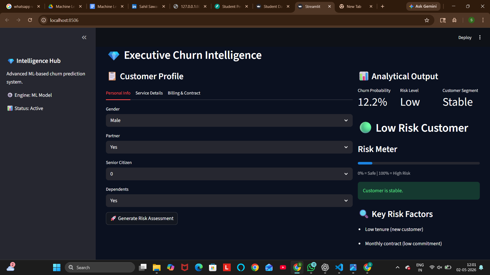
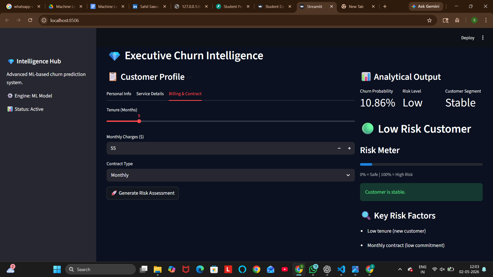
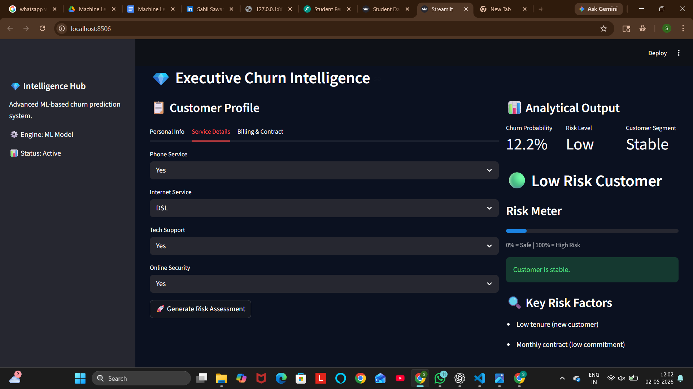

# 🚀 Customer Churn Prediction System with Explainable Insights

## 📌 1. Problem Statement

Customer churn is a critical business problem where companies lose customers over time. Retaining existing customers is significantly cheaper than acquiring new ones.

This project builds a **machine learning classification system** that predicts whether a customer is likely to churn and provides **interpretable reasons and retention strategies**.

---

## 🎯 2. Objectives

* Predict customer churn (Binary Classification)
* Identify key risk factors influencing churn
* Provide actionable business insights
* Build an interactive Streamlit dashboard for real-time predictions

---

## 📊 3. Dataset Overview

Typical features used in churn prediction:

| Feature Type  | Examples                     |
| ------------- | ---------------------------- |
| Customer Info | Gender, SeniorCitizen        |
| Account Info  | Tenure, Contract Type        |
| Services      | InternetService, TechSupport |
| Billing       | MonthlyCharges, TotalCharges |

---

## 🧠 4. Machine Learning Pipeline

### 🔹 Data Preprocessing

* Handling missing values
* Encoding categorical variables
* Feature scaling using StandardScaler

### 🔹 Model Used

* Logistic Regression / Random Forest (based on your implementation)

### 🔹 Evaluation Metrics

* Accuracy
* Precision / Recall
* Confusion Matrix

---

## ⚙️ 5. Project Architecture

```text
customer-churn-prediction/
│
├── models/                  # Saved ML models (pkl)
├── outputs/                 # Evaluation results (plots)
├── src/                     # Utility scripts / logic
├── app.py                   # Streamlit frontend
├── main.py                  # Model training pipeline
├── requirements.txt         # Dependencies
└── README.md
```

---

## 🖥️ 6. Streamlit Application

The UI allows users to:

* Input customer details
* Predict churn probability
* View risk classification
* Understand reasons behind prediction

---

## 💡 7. Explainability Logic

The system identifies churn risk based on:

* Low tenure → New customers are more likely to churn
* High monthly charges → Cost-sensitive users
* No tech support → Poor service experience
* Monthly contract → Low commitment

---

## 🧾 8. Sample Output

| Output Type | Description              |
| ----------- | ------------------------ |
| Prediction  | Churn / No Churn         |
| Risk Level  | Low / Medium / High      |
| Reasons     | Key contributing factors |

---

## 📸 9. Screenshots

### 🔹 Main Dashboard


### 🔹 Prediction Output


### 🔹 Customer Profile

---

## ⚙️ 10. Installation & Setup

```bash
git clone https://github.com/sujalkrshaw/customer-churn-prediction.git
cd customer-churn-prediction
pip install -r requirements.txt
```

---

## ▶️ 11. Run Application

```bash
streamlit run app.py
```

Then open:
http://localhost:8501

---

## 📈 12. Model Performance (Example)

| Metric    | Value    |
| --------- | -------- |
| Accuracy  | ~80–85%  |
| Precision | Good     |
| Recall    | Balanced |

---

## 🔥 13. Future Improvements

* Add SHAP / LIME explainability
* Deploy using Docker + Cloud
* Add REST API (FastAPI)
* Improve UI/UX design

---

## 🌐 14. Deployment (Recommended)

Deploy using:

* Streamlit Cloud
* Render
* AWS EC2

---

## 👨‍💻 15. Author

**Sujal  kumar Shaw**

---

## ⭐ 16. Why This Project Stands Out

* End-to-end ML pipeline
* Real-time prediction UI
* Business-oriented insights
* Explainable AI approach

---

## 📢 17. Contribution

Pull requests are welcome. For major changes, please open an issue first.

---

## 📜 18. License

This project is open-source and available under the MIT License.
